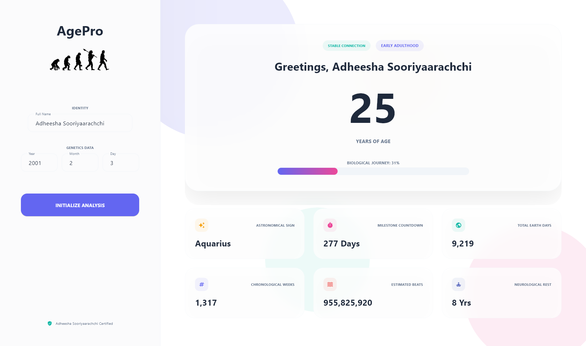

# AgePro Elite: Professional Age Analytics Suite

AgePro Elite is a high-end desktop application designed for precise chronological tracking and biological data visualization. Built on the Flet framework, it offers a sophisticated "Liquid Glass" interface combined with an intelligent Bento-style dashboard to deliver deep personal insights beyond standard age calculation.



## Key Features

### Liquid Glass Interface
The application utilizes advanced glassmorphic design principles, featuring high-blur containers, light-reflective borders, and dynamic background mesh gradients. This ensures a premium, modern aesthetic consistent with professional SaaS software.

### Bento-Grid Dashboard
Data is organized using a non-linear Bento-style grid, optimizing visual hierarchy for key biological metrics such as heartbeat estimations, sleep cycle tracking, and astronomical identifiers.

### Intelligent Life-Stage Analysis
Beyond numerical output, the system performs semantic analysis to identify the user's current life stage (e.g., Early Adulthood, Adolescence), providing a broader context to the chronological data.

### Real-time Biological Metrics
- Astronomical Sign Identification (Zodiac).
- Milestone Countdown (Next Birthday).
- Cumulative Biological Activity (Total Heartbeats).
- Neurological Recovery Estimation (Sleep/Dreams).
- Comprehensive Chronological Data (Total Days/Weeks).

## Technical Architecture

- **Core Framework**: Flet (Python-based Flutter implementation)
- **Styling**: Custom CSS-like properties with explicit alignment coordinate systems.
- **Visuals**: Vector-based icons and high-depth box shadows.
- **Performance**: Asynchronous UI updates for smooth transitions and fluid animations.

## Installation and Setup

### Prerequisites
- Python 3.8 or higher
- Flet library

### Installation Steps
1. Clone the repository.
2. Install the required dependencies:
   ```bash
   pip install flet
   ```
3. Execute the application:
   ```bash
   python main.py
   ```

## Developer Information

Developed and Engineered by: **Adheesha Sooriyaarachchi**

## License
All rights reserved. Unauthorized reproduction or distribution is strictly prohibited.
